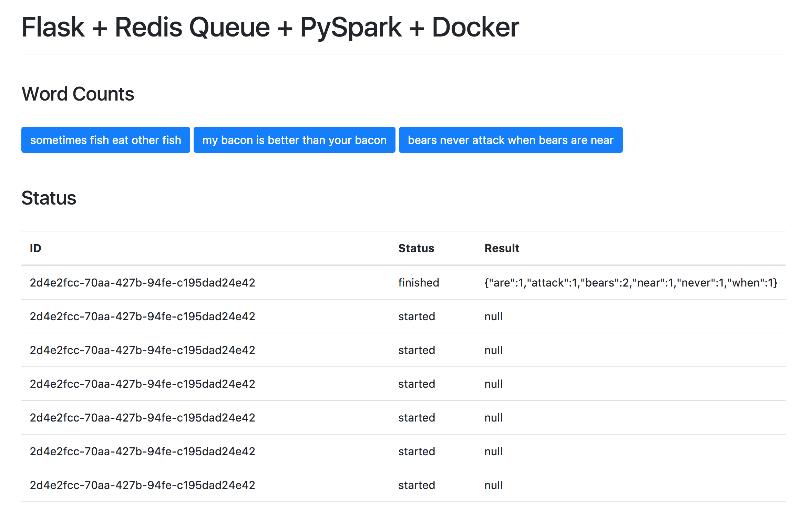

# Flask + Redis Queue + PySpark + Docker

Just a boilerplate for PySpark and Flask

### Quick Start

Spin up the containers:

```sh
$ docker-compose up -d --build
```

Open your browser to http://localhost:5001

### Example


